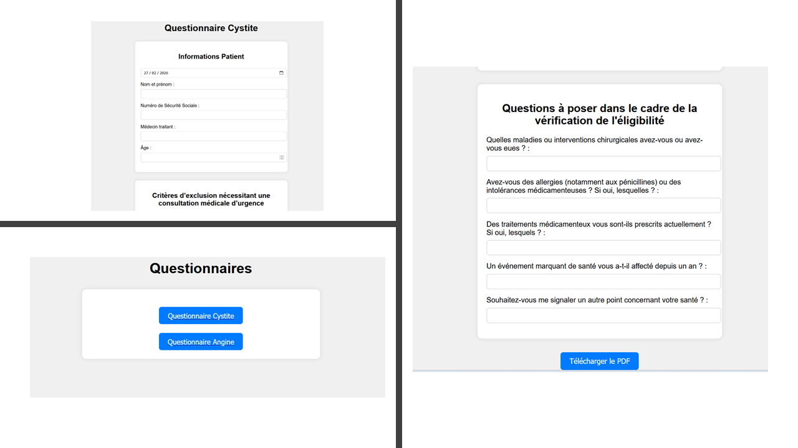

# Pharmaceutical Services in French Community Pharmacy

This project aims to simplify the **collection and storage** of **patient data** for **community pharmacists** managing patients presenting symptoms of:

* cystitis ;
* tonsillitis (Angina).

It also provides structured clinical information to support pharmacists in their decision-making process.

## Flask Application : Patient Inquiry to PDF

This Flask web application assists French community pharmacists in managing their new responsibilities related to the **Rapid Diagnostic Orientation Test** (RADOT).

RADOT can be performed in pharmacies for:

* tonsillitis (Angina) for men and women ;
* cystitis for women.

The application provides:

* patient information displayed as structured text ;
* inclusion and exclusion criteria presented as checkboxes.

Based on the selected criteria, the pharmacist can determine:

* Whether a RADOT is indicated.
* If the test result is positive, which antibiotic should be recommended according to current French therapeutic guidelines.

### Features

* Flask backend to collect and process user selections ;
* Generic and customizable questionnaire templates ;
* JSON-based questionnaire structure ;
* Structured decision-support logic ;
* PDF-ready output.

### Installation and Usage

1️⃣ Install dependencies

```bash
pip install -r requirements.txt
```

2️⃣ Run the application

```bash
python app.py
```

3️⃣ Open in your browser

```bash
http://127.0.0.1:5000
```

## About Pharmaceutical Services in France

French community pharmacists are trained and certified to perform Rapid Diagnostic Orientation Tests (RADOT).

Currently, the two main RADOT services available in community pharmacies are:

* Tonsillitis (Angina) testing ;
* Cystitis testing.

This project support educational blog pages (in French and English) :

*  (fr) /  (en)
*  (fr) /  (en)

## Demo


